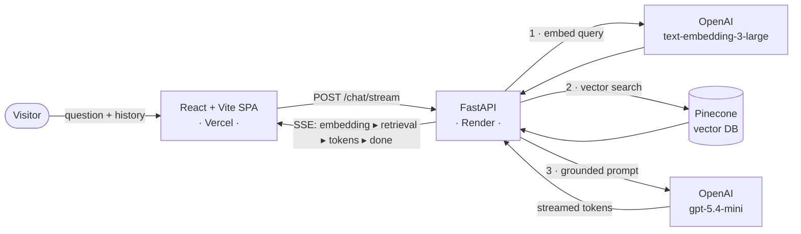

<div align="center">

# 🤖 NicoBot — AI Portfolio

### An AI that knows my résumé better than I do.

A recruiter-facing portfolio where visitors **chat with an AI** about my work, skills, and projects — every answer grounded in a retrieval-augmented (RAG) knowledge base, streamed token-by-token with a live view of the pipeline.

[**🌐 Live → swedev.online**](https://swedev.online)


</div>

---

## ✨ Why it's different

Most portfolios are static. This one answers questions.

- 💬 **Conversational** — ask *"Does he know React?"* then *"how did he apply it?"* and it follows the thread (real conversation memory).
- 🧠 **Grounded, not hallucinated** — answers are retrieved from a curated knowledge base via vector search. Each reply shows a **"Based on…"** citation you can expand to see the exact source fact + similarity score.
- ⚡ **Streaming** — replies stream token-by-token over Server-Sent Events.
- 🔬 **Geek mode** — a live neural-network visualization shows the *real* embedding → retrieval → generation pipeline with per-stage telemetry (vector dimensions, norm, similarity scores, token counts, latencies).
- 🛡️ **Production-minded** — input validation, sanitization, rate limiting, prompt-injection resistance, and guardrails that keep the bot on-topic and on-message.
- 🎯 **Recruiter shortcuts** — one-tap LinkedIn / GitHub / résumé / email, plus contextual follow-up suggestions.

## 🏗️ Architecture



**The RAG flow, end to end:**
1. The question (plus recent conversation) is embedded with `text-embedding-3-large` (1536-dim).
2. Pinecone returns the top-k most similar knowledge-base facts by cosine similarity.
3. `gpt-5.4-mini` answers grounded **only** in those facts, streamed back token-by-token.
4. Embedding stats, retrieval scores, and generation telemetry stream alongside to power "geek mode."

## 🧰 Tech stack

| Layer | Tech |
|---|---|
| **Frontend** | React · TypeScript · Vite · React Router · react-markdown |
| **Backend** | FastAPI · Python · SlowAPI (rate limiting) |
| **AI** | OpenAI `text-embedding-3-large` + `gpt-5.4-mini` · Pinecone (vector DB) |
| **Hosting** | Vercel (frontend) · Render (backend) |

## 📂 Project structure

```
.
├── frontend/                   # React + Vite single-page app
│   └── src/
│       ├── components/         # ChatBox (SSE), NeuralNetworkViz, MessagePanel, SuggestedQuestions
│       └── pages/              # Résumé viewer
└── backend/                    # FastAPI service
    ├── main.py                 # /chat, /chat/stream (SSE), /warmup — the RAG pipeline
    ├── config.py               # centralized model configuration
    ├── embeddings_pinecone.py  # builds the Pinecone index from portfolio_docs.json
    ├── portfolio_docs.json     # the knowledge base (source of truth = résumé)
    └── tests/                  # pytest suite
```

## 🚀 Getting started

**Prerequisites:** Node 20+, Python 3.12+, and OpenAI + Pinecone API keys.

### Backend
```bash
cd backend
python -m venv .venv && source .venv/bin/activate
pip install -r requirements.txt

# create .env with:
#   OPENAI_API_KEY=sk-...
#   PINECONE_API_KEY=...

python embeddings_pinecone.py        # build/refresh the vector index
uvicorn main:app --reload            # → http://localhost:8000
```

### Frontend
```bash
cd frontend
npm install
echo "VITE_API_URL=http://localhost:8000" > .env
npm run dev                          # → http://localhost:5173
```

## 🧠 Updating the knowledge base

The bot only knows what's in `backend/portfolio_docs.json`. After editing it — or changing the embedding model — rebuild the index:

```bash
cd backend && python embeddings_pinecone.py   # clears + re-embeds all vectors
```

## 🔌 API

| Method | Endpoint | Description |
|---|---|---|
| `POST` | `/chat` | RAG answer (JSON) with full pipeline metadata |
| `POST` | `/chat/stream` | Same answer, streamed via Server-Sent Events |
| `GET` | `/warmup` | Warms the Pinecone query path (handles free-tier cold starts) |
| `GET` | `/` | Health check |

Every request is validated, sanitized, and rate-limited (20 req/min per IP).

## 🧪 Tests

```bash
cd backend && pytest      # validation · history · retrieval · GPT-5 params · streaming
```

## ☁️ Deployment

- **Frontend → Vercel** — set `VITE_API_URL` to the backend URL, build with `npm run build`.
- **Backend → Render** — start command `uvicorn main:app --host 0.0.0.0 --port $PORT`; set `OPENAI_API_KEY` and `PINECONE_API_KEY`. Re-run `embeddings_pinecone.py` whenever the knowledge base or embedding model changes.

---

<div align="center">

Built by **Nico Bourel** · [swedev.online](https://swedev.online)

</div>
