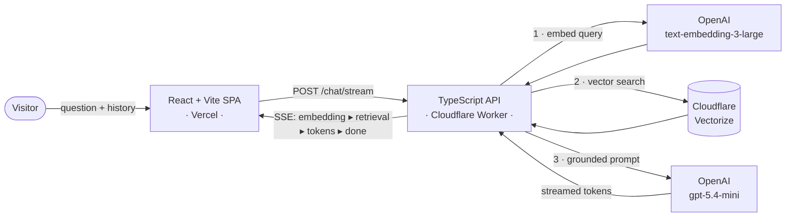

<div align="center">

# 🤖 NicoBot — AI Portfolio

### An AI that knows my résumé better than I do.

A recruiter-facing portfolio where visitors **chat with an AI** about my work, skills, and projects — every answer grounded in a retrieval-augmented (RAG) knowledge base, streamed token-by-token with a live view of the pipeline.

[**🌐 Live → swedev.online**](https://swedev.online)


</div>

---

## ✨ Why it's different

Most portfolios are static. This one answers questions.

- 💬 **Conversational** — ask *"Does he know React?"* then *"how did he apply it?"* and it follows the thread (real conversation memory).
- 🧠 **Grounded, not hallucinated** — answers are retrieved from a curated knowledge base via vector search. Each reply shows a **"Based on…"** citation you can expand to see the exact source fact + similarity score.
- ⚡ **Streaming** — replies stream token-by-token over Server-Sent Events.
- 🔬 **Geek mode** — a live neural-network visualization shows the *real* embedding → retrieval → generation pipeline with per-stage telemetry (vector dimensions, norm, similarity scores, token counts, latencies).
- 🛡️ **Production-minded** — input validation, sanitization, rate limiting, prompt-injection resistance, and guardrails that keep the bot on-topic and on-message.
- 🎯 **Recruiter shortcuts** — one-tap LinkedIn / GitHub / résumé / email, plus contextual follow-up suggestions.

## 🏗️ Architecture



**The RAG flow, end to end:**
1. The question (plus recent conversation) is embedded with `text-embedding-3-large` (1536-dim).
2. Cloudflare Vectorize returns the top-k most similar knowledge-base facts by cosine similarity.
3. `gpt-5.4-mini` answers grounded **only** in those facts, streamed back token-by-token.
4. Embedding stats, retrieval scores, and generation telemetry stream alongside to power "geek mode."

## 🧰 Tech stack

| Layer | Tech |
|---|---|
| **Frontend** | React · TypeScript · Vite · React Router · react-markdown |
| **API** | Cloudflare Workers · TypeScript · Server-Sent Events · native rate limiting |
| **AI** | OpenAI `text-embedding-3-large` + `gpt-5.4-mini` · Cloudflare Vectorize |
| **Hosting** | Vercel (frontend) · Cloudflare Workers (API + retrieval) |

## 📂 Project structure

```
.
├── frontend/                   # React + Vite single-page app
│   └── src/
│       ├── components/         # ChatBox (SSE), NeuralNetworkViz, MessagePanel, SuggestedQuestions
│       └── pages/              # Résumé viewer
├── cloudflare-worker/          # production RAG API
│   ├── src/                    # retrieval, prompting, routes, and SSE streaming
│   ├── scripts/                # deterministic Vectorize indexing
│   └── test/                   # contract and behavior tests
└── backend/                    # legacy FastAPI rollback service
    └── portfolio_docs.json     # curated knowledge base
```

## 🚀 Getting started

**Prerequisites:** Node 20+, an OpenAI API key, and a Cloudflare account with Wrangler authenticated.

### API
```bash
cd cloudflare-worker
npm install
npx wrangler vectorize create nicobot-portfolio --dimensions=1536 --metric=cosine
OPENAI_API_KEY=sk-... npm run index
npx wrangler secret put OPENAI_API_KEY
npm run dev                         # local Worker runtime
```

### Frontend
```bash
cd frontend
npm install
# set VITE_API_URL to the local or deployed Worker URL
npm run dev                         # → http://localhost:5173
```

## 🧠 Updating the knowledge base

The bot only knows what's in `backend/portfolio_docs.json`. After editing it — or changing the embedding model — rebuild the index:

```bash
cd cloudflare-worker && npm run index
```

## 🔌 API

| Method | Endpoint | Description |
|---|---|---|
| `POST` | `/chat` | RAG answer (JSON) with full pipeline metadata |
| `POST` | `/chat/stream` | Same answer, streamed via Server-Sent Events |
| `GET` | `/warmup` | Compatibility health probe; no application warm-up is required |
| `GET` | `/` | Health check |

Every request is validated, sanitized, and rate-limited (20 req/min per IP).

## 🧪 Tests

```bash
cd cloudflare-worker && npm run validate
cd frontend && npm run build && npm run lint
```

## ☁️ Deployment

- **Frontend → Vercel** — set `VITE_API_URL` to the deployed Worker URL, then build with `npm run build`.
- **API → Cloudflare Workers** — bind the `nicobot-portfolio` Vectorize index, add `OPENAI_API_KEY` with Wrangler secrets, then run `npm run deploy`.

---

<div align="center">

Built by **Nico Bourel** · [swedev.online](https://swedev.online)

</div>
